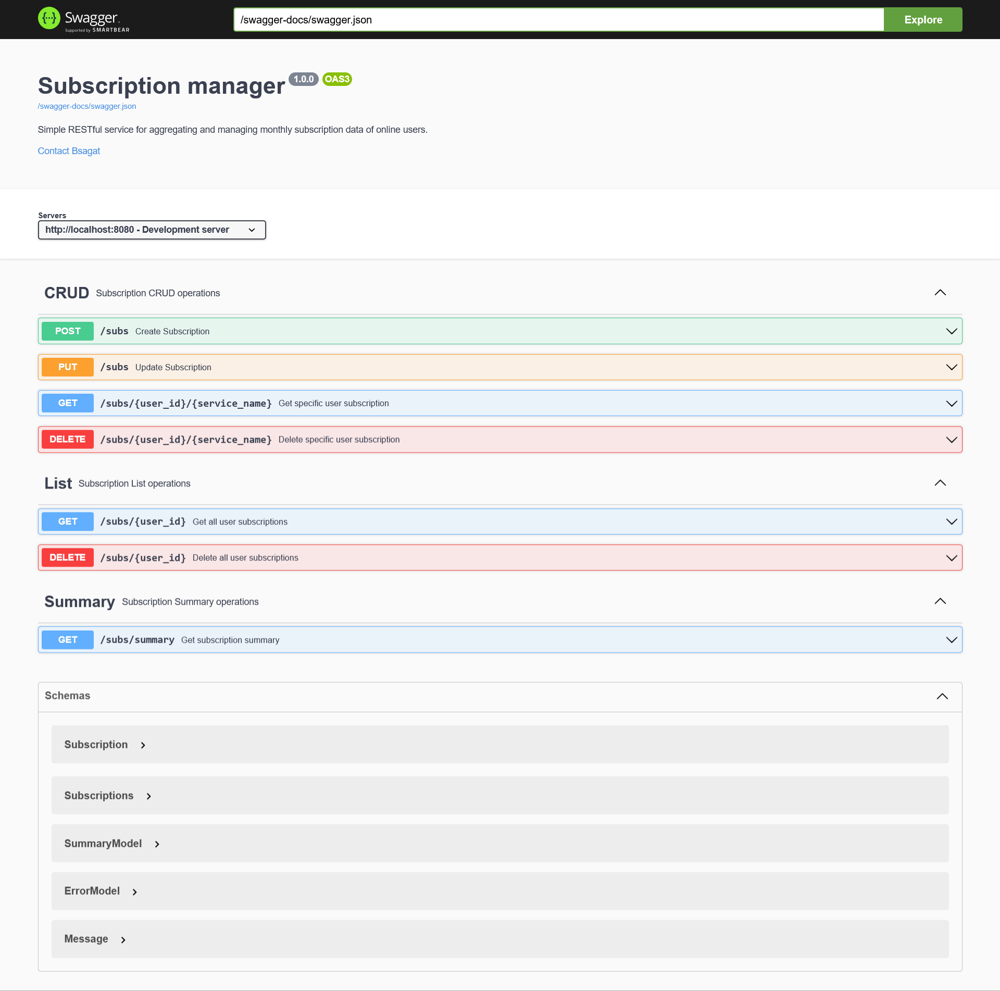

# Subscription Manager 💳



A simple, robust RESTful service designed for aggregating and managing monthly subscription data for online users. Built with Go, this service adheres to a **hexagonal architecture** (ports and adapters), ensuring a clear separation of concerns, maintainability, and testability.

---

## 🌟 Features

* **Subscription CRUD**: Create, Read, Update, and Delete individual user subscriptions.
* **User Subscription Management**: Retrieve and delete all subscriptions for a specific user.
* **Subscription Summaries**: Get aggregated financial summaries of subscriptions based on various filters (date range, user ID, service name).
* **Database Integration**: Persistent storage using PostgreSQL with built-in migrations.
* **Comprehensive API Documentation**: Powered by OpenAPI (Swagger UI).
* **Containerized Deployment**: Easy setup and deployment using Docker Compose.
* **Test Coverage**: Extensive unit and integration tests to ensure reliability.
---

## 🏗️ Architecture

The project is structured following a **Hexagonal Architecture** (also known as Ports and Adapters). This design paradigm ensures that the core business logic remains independent of external concerns like databases, UI, or external APIs.

* **Ports**: Define the interfaces that the application's core logic (`domain`) interacts with. These are technology-agnostic.
* **Adapters**: Implement these ports, providing the concrete technology-specific implementations (e.g., PostgreSQL adapter for database port, HTTP adapter for API port).

A visual representation of the database schema (ERD) can be found at `docs/erd`.

---

## 🚀 Getting Started

These instructions will get a copy of the project up and running on your local machine for development and testing purposes.

### Prerequisites

* Docker and Docker Compose
* Go (version 1.20+ recommended for local development/testing outside Docker)

### Installation and Running

1.  **Clone the repository**:
    ```bash
    git clone [https://github.com/bsagat/effective-subscriptions](https://github.com/bsagat/effective-subscriptions) 
    cd submanager
    ```

2.  **Configure Environment Variables**:
    The application uses environment variables for configuration.
    Copy the example environment file:
    ```bash
    cp .env.example .env
    ```
    Open the newly created `.env` file and adjust the values as needed. Key configurations include database connection details, server host/port, and logging settings.

3.  **Start the Application**:
    Use Docker Compose to build and run the application and its dependencies (e.g., PostgreSQL).
    ```bash
    docker-compose up --build
    ```
    This command will:
    * Build the Go application image.
    * Set up a PostgreSQL database container.
    * **Run database migrations automatically** when the application starts.
    * Start the Subscription Manager service.

    The service will be accessible on `http://localhost:8080` by default.

---

## 📖 API Documentation (Swagger UI)

The API is fully documented using OpenAPI (Swagger). Once the application is running, you can access the interactive API documentation at:

👉 [http://localhost:8080/swagger/index.html](http://localhost:8080/swagger/index.html)

This interface allows you to explore all available endpoints, their request/response schemas, and even try out API calls directly from your browser.

Here's a snapshot of the Swagger UI:
![Swagger API documentation page]

### API Endpoints Overview:

* **`/subs` (POST)**: Create a new subscription.
* **`/subs` (PUT)**: Update an existing user subscription.
* **`/subs/{user_id}` (GET)**: Retrieve all subscriptions for a specific user.
* **`/subs/{user_id}` (DELETE)**: Delete all subscriptions for a specific user.
* **`/subs/{user_id}/{service_name}` (GET)**: Retrieve a specific subscription by user ID and service name.
* **`/subs/{user_id}/{service_name}` (DELETE)**: Delete a specific subscription by user ID and service name.
* **`/subs/summary` (GET)**: Get a summary of user subscriptions with optional filters (date range, user ID, service name).

For detailed request and response models, refer to the Swagger UI.

---

## 🧪 Running Tests

The project includes a comprehensive test suite to ensure reliability and correctness.

To run all tests:

```bash
go test ./...